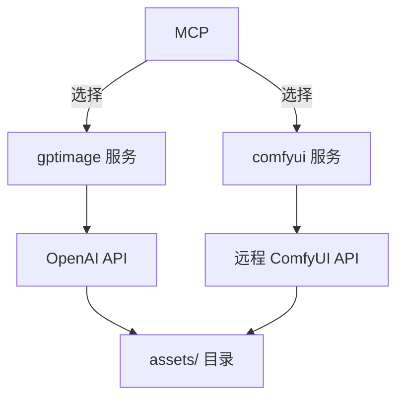

# 图片素材生成方案讨论

## 当前实现

- **服务**: `src/main/services/gptimage.ts` (OpenAI gpt-image-1.5)
- **3D**: `src/main/services/hy3d.ts` (腾讯 HY 3D)
- **输出**: PNG，1024×1024，透明背景
- **存储**: `.genieengine/` 目录，按 ECS 结构组织

## 提议: ComfyUI 远程 API 集成

### 可行性

✅ 技术上完全可行
- ComfyUI 提供完整 REST API (`/prompt`, `/queue`, `/history`)
- 支持 WebSocket 实时进度
- 工作流 JSON 配置灵活

### 可控性对比

| 维度 | OpenAI API | ComfyUI 远程 |
|------|-----------|-------------|
| 模型选择 | 固定 gpt-image-1.5 | 可切换任意 checkpoint |
| ControlNet | ❌ 不支持 | ✅ 精确控制构图/姿态 |
| LoRA | ❌ 不支持 | ✅ 风格一致性 |
| 参考图 | 有限 | ✅ IP-Adapter 等 |
| 采样参数 | 固定 | ✅ 步数/CFG/采样器 |
| 后处理 | ❌ | ✅ 超分/面部修复等 |

### 架构建议

双引擎并行，非替换：

**优势**：
- OpenAI: 快速原型 (~10-30秒)
- ComfyUI: 精细制作 (30-120秒，节点级控制)

### 实施步骤

1. **Skill 开发**: `skills/comfyui/` (工作流模板 + 文档)
2. **服务开发**: `src/main/services/comfyui.ts` (远程 API 调用)
3. **MCP 集成**: 新增工具或参数选择
4. **UI 配置**: 服务器地址、模型选择等

### 关键文件路径

- `src/main/services/gptimage.ts` - 现有 2D 服务
- `src/main/services/hy3d.ts` - 3D 服务
- `src/main/services/asset-store.ts` - 资产管理

### 决策点

- [ ] 是否新增 ComfyUI Skill？✅ 建议新增
- [ ] 替换还是并行？✅ 双引擎并行
- [ ] 工作流模板设计？待讨论
- [ ] 认证方式？待确定
- [ ] 错误处理策略？待设计
